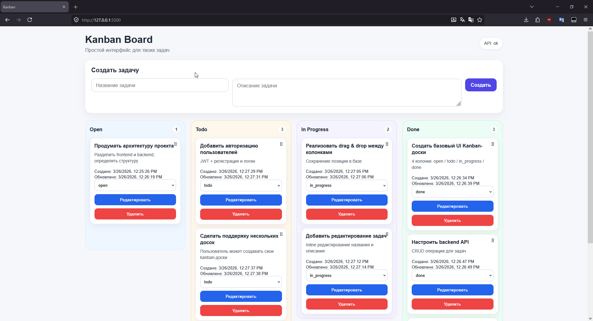
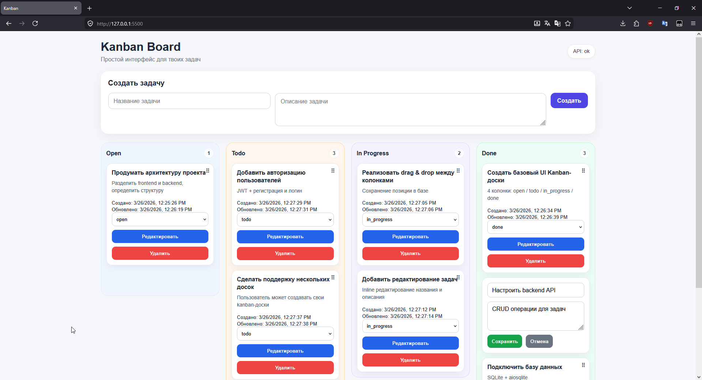

# Kanban Board

Простой Kanban с FastAPI и чистым JS.

## Demo



## Preview



## Запуск

```bash
pip install -r requirements.txt
python -m backend.seed
uvicorn backend.main:app --reload
```

Открыть:

```
frontend/index.html
```

---

## Стек

* FastAPI
* SQLite (aiosqlite)
* Pydantic
* Vanilla JS

---

## Возможности

* CRUD задач
* Drag & Drop
* Сохранение порядка
* Статусы (open / todo / in_progress / done)